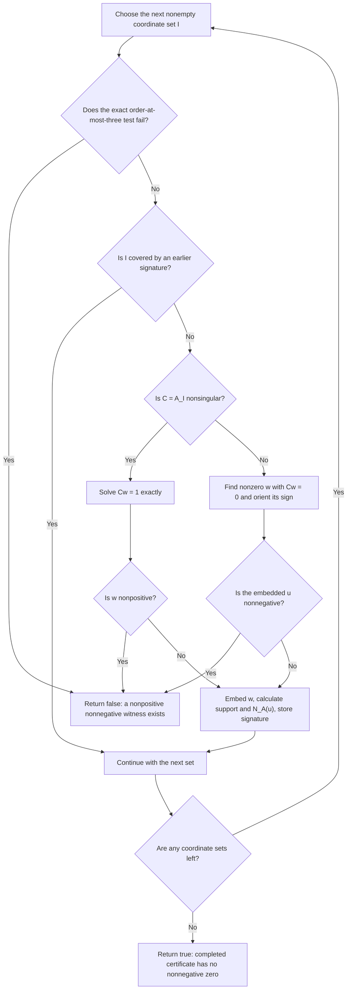

# Dickinson's Copositivity Algorithm, Step By Step

This is a slow introduction to the maintained `dickinson_2019` model. It assumes only first-semester linear algebra: vectors,
matrices, matrix multiplication, and solving a linear system.

The authoritative model description is [`models/baselines/dickinson_2019/ALGORITHM.md`](../models/baselines/dickinson_2019/ALGORITHM.md). This document
explains the same algorithm more gently. Dickinson's paper is:

- Peter J. C. Dickinson, “A New Certificate for Copositivity,” *Linear Algebra and its Applications* 569, 15–37 (2019),
  [DOI 10.1016/j.laa.2018.12.025](https://doi.org/10.1016/j.laa.2018.12.025).

## 1. What Question Are We Answering?

Let $A$ be a real symmetric $n\times n$ matrix. We look at the quadratic expression

$$
q(x)=x^TAx.
$$

The vector $x$ is restricted to the nonnegative orthant:

$$
x\geq0,
$$

which means that every coordinate of $x$ is nonnegative.

The matrix is **copositive** when

$$
x^TAx\geq0
\qquad\text{for every }x\geq0.
$$

It is **strictly copositive** when

$$
x^TAx>0
\qquad\text{for every nonzero }x\geq0.
$$

The word “strictly” matters at equality. A nonzero vector $x\geq0$ with $x^TAx=0$ does not disprove non-strict copositivity, but it
does disprove strict copositivity. coposit's `dickinson_2019` model decides the strict version.

There are therefore three mathematical situations:

1. Some nonnegative vector has $x^TAx<0$: the matrix is not copositive and not strictly copositive.
2. No nonnegative vector has a negative value, but some nonzero nonnegative vector has value zero: the matrix is copositive but not
   strictly copositive.
3. Every nonzero nonnegative vector has a positive value: the matrix is strictly copositive.

## 2. The Main Difficulty

There are infinitely many nonnegative vectors. We cannot test them one by one.

Dickinson replaces that infinite question with a finite search over sets of coordinates. There are still potentially many such
sets, but one calculated vector can often explain many sets at once.

The algorithm is therefore best remembered as:

> Visit coordinate sets, solve one exact linear-algebra problem for every set not already covered, and use the resulting vectors to
> cover later sets.

## 3. Why Coordinate Sets Appear

Consider a nonnegative vector such as

$$
x=(2,0,5,0)^T.
$$

Only coordinates 1 and 3 are active. The **support** of $x$ is the set of its nonzero coordinates:

$$
\operatorname{supp}(x)=\{1,3\}.
$$

Now choose any nonempty coordinate set $I$. The **principal submatrix** $A_I$ is made by keeping the rows and columns whose indices
belong to $I$.

For example, if

$$
A=
\begin{pmatrix}
a_{11}&a_{12}&a_{13}\\
a_{12}&a_{22}&a_{23}\\
a_{13}&a_{23}&a_{33}
\end{pmatrix}
$$

and $I=\{1,3\}$, then

$$
A_I=
\begin{pmatrix}
a_{11}&a_{13}\\
a_{13}&a_{33}
\end{pmatrix}.
$$

If $x$ is zero outside $I$, its quadratic value depends only on $A_I$:

$$
x^TAx=x_I^TA_Ix_I.
$$

So every possible nonnegative witness lives on some nonempty coordinate set. That is why Dickinson examines principal submatrices.

An $n$-coordinate matrix has

$$
2^n-1
$$

nonempty coordinate sets. This is finite, but it becomes enormous when $n$ grows. The coverage rule below is what makes the method
practical on favorable matrices.

## 4. Two Sets Stored For A Certificate Vector

Suppose the algorithm has calculated a full $n$-coordinate vector $u$ with at least one positive coordinate.

It keeps two sets.

### 4.1 The support

The first set is

$$
S(u)=\operatorname{supp}(u)=\{i:u_i\neq0\}.
$$

This says where $u$ itself is nonzero.

### 4.2 The nonnegative-product set

Calculate the matrix-vector product $Au$. Then define

$$
N_A(u)=\{i:(Au)_i\geq0\}.
$$

This says where the product $Au$ is nonnegative. Zero counts as nonnegative.

The complete vector $u$ is not needed for later coverage tests. coposit stores the two sets $S(u)$ and $N_A(u)$ as the vector's
**certificate signature**.

## 5. Dickinson's Certificate Theorem

Dickinson's Theorem 4.6 is a theorem about non-strict copositivity. The paper writes

$$
[1:n]=\{1,\ldots,n\},
\qquad
\mathcal P[n]=\{I\subseteq[1:n]:I\neq\varnothing\}.
$$

Its statement is

$$
A\in\operatorname{COP}^n
\quad\Longleftrightarrow\quad
\exists U\subseteq\mathbb R^n\setminus(-\mathbb R_+^n)\;
\forall I\in\mathcal P[n]\;
\exists u\in U:
\operatorname{supp}(u)\subseteq I\subseteq\operatorname{supp}_{\geq0}(Au).
$$

In words:

> Let $A\in\mathbb S^n$ be symmetric. Then $A$ is copositive if and only if there is a set
> $U\subseteq\mathbb R^n\setminus(-\mathbb R_+^n)$ such that, for every nonempty
> $I\subseteq\{1,\ldots,n\}$, there is a vector $u\in U$ satisfying
> $$
> \operatorname{supp}(u)\subseteq I\subseteq\operatorname{supp}_{\geq0}(Au).
> $$

Using the shorter names from Section 4, the last line is exactly

$$
S(u)\subseteq I\subseteq N_A(u).
$$

The order of the three statements matters:

$$
\text{there exists one set }U;
\qquad
\text{for every nonempty }I;
\qquad
\text{there exists a suitable }u\in U.
$$

Different coordinate sets $I$ may use different vectors from $U$. One vector may also work for many different sets $I$.

### 5.1 What every symbol means

- $\mathbb S^n$ is the set of symmetric $n\times n$ matrices.
- $\mathbb R_+^n$ contains the vectors whose coordinates are all nonnegative.
- $-\mathbb R_+^n$ contains the vectors whose coordinates are all nonpositive.
- Therefore $u\notin-\mathbb R_+^n$ means that $u$ has at least one positive coordinate. It may nevertheless have other coordinates
  that are zero or negative.
- $I$ is a nonempty set of coordinate numbers. It identifies one face of the nonnegative orthant and the corresponding principal
  submatrix $A_I$.
- $S(u)=\operatorname{supp}(u)=\{i:u_i\neq0\}$ contains the nonzero coordinates of $u$. A negative coordinate is in the support too.
- $N_A(u)=\operatorname{supp}_{\geq0}(Au)=\{i:(Au)_i\geq0\}$ contains the coordinates where the product $Au$ is nonnegative. This is
  not the support of $u$. Zero is included.
- The symbol $\subseteq$ means “is contained in.” It is not a numerical comparison, and equality is allowed at either end.

### 5.2 What the two containments demand

The first containment,

$$
S(u)\subseteq I,
$$

says that $u$ has no nonzero coordinate outside $I$. In other words, $u$ lives entirely on the face selected by $I$.

The second containment,

$$
I\subseteq N_A(u),
$$

says that

$$
(Au)_i\geq0\qquad\text{for every }i\in I.
$$

Coordinates outside $I$ do not have to satisfy this second condition. If some of them do, however, the same vector may cover larger
sets later.

Together the containments say:

> The vector $u$ is nonzero only inside $I$, has at least one positive coordinate, and $Au$ is nonnegative on every coordinate in $I$.

### 5.3 A concrete example

Suppose $n=5$ and

$$
u=(0,2,0,-1,0)^T,
\qquad
Au=(3,0,-5,7,1)^T.
$$

Then

$$
S(u)=\{2,4\},
\qquad
N_A(u)=\{1,2,4,5\}.
$$

The possible covered sets must contain both 2 and 4, may additionally contain 1 or 5, and may not contain 3. Therefore this one vector
covers exactly

$$
\{2,4\},\quad
\{1,2,4\},\quad
\{2,4,5\},\quad
\{1,2,4,5\}.
$$

It does not cover $\{2\}$ because that set omits coordinate 4 from $S(u)$. It does not cover $\{2,3,4\}$ because coordinate 3 is not
in $N_A(u)$.

In general, if $S(u)\subseteq N_A(u)$, the number of coordinate sets covered by this vector is

$$
2^{\lvert N_A(u)\rvert-\lvert S(u)\rvert}.
$$

Every coordinate in $S(u)$ is compulsory, every coordinate in $N_A(u)\setminus S(u)$ is optional, and every coordinate outside
$N_A(u)$ is forbidden.

### 5.4 Why this certifies copositivity

A stored vector $u$ covers a coordinate set $I$ when

$$
S(u)\subseteq I\subseteq N_A(u).
$$

Read this from left to right:

1. $I$ contains every coordinate where $u$ is nonzero.
2. Every coordinate in $I$ is a coordinate where $Au$ is nonnegative.

Dickinson's certificate theorem says that such an $I$ does not need a new vector. The existing vector $u$ already accounts for it,
so the algorithm skips the principal submatrix $A_I$.

There is also a useful algebraic reason why these two containments belong together. The first says that $u$ lives entirely on the
coordinate face $I$. The second gives, for every $x\geq0$ supported on $I$,

$$
x^TAu=\sum_{i\in I}x_i(Au)_i\geq0.
$$

Dickinson's theorem turns these face and product facts into the formal permission to reuse $u$ instead of generating another vector
for $I$.

This is the central saving in the algorithm: one vector may let us skip many later principal submatrices.

The theorem's proof can be understood through a contradiction. Suppose $A$ were not copositive. Choose a smallest nonempty set $I$
for which $A_I$ is not copositive. Every proper principal submatrix inside $A_I$ is then copositive. Dickinson's Lemma 4.4 says that
such a smallest bad submatrix cannot have a vector $u_I$ that has a positive coordinate and satisfies

$$
A_Iu_I\geq0.
$$

But a covering vector would give exactly that: $S(u)\subseteq I$ makes $u$ zero outside $I$, and $I\subseteq N_A(u)$ gives

$$
A_Iu_I=(Au)_I\geq0.
$$

Therefore a smallest bad set cannot be covered. If every nonempty $I$ is covered, no bad set exists and $A$ is copositive.

Conversely, if $A$ is copositive, every principal submatrix $A_I$ is copositive. Dickinson's lemma supplies a suitable local vector for
each $I$. Embedding each local vector into $n$ coordinates by putting zeros outside $I$ produces a set $U$ with the required coverage.

The theorem itself proves non-strict copositivity, $x^TAx\geq0$. coposit uses this certificate construction inside a strict-copositivity
solver, so it must additionally reject an exact nonnegative zero with $x^TAx=0$. Equality cannot simply be treated as a successful
strict result.

## 6. The Order Of The Search

coposit visits every possible nonempty coordinate set in increasing size:

$$
|I|=1,2,3,\ldots,n.
$$

Within one size it uses a fixed deterministic order. A different order can change which vectors are generated and how much work is
skipped, but it does not change the correct final Boolean answer.

For every set $I$, the algorithm asks:

1. Does coposit's small direct test already disprove strict copositivity on this principal submatrix?
2. Does an earlier certificate vector cover $I$?
3. If neither applies, what vector does $A_I$ generate?

## 7. coposit's Direct Test Through Order Three

This step is a coposit addition, not part of Dickinson's published algorithm.

When $|I|\leq3$, coposit first uses exact closed-form tests for strict copositivity of $A_I$.

- At order 1, the diagonal entry must be positive.
- At order 2, the diagonal entries must be positive, and a negative off-diagonal entry must not be strong enough to produce a
  nonpositive quadratic value.
- At order 3, coposit checks all order-two faces and then an exact determinant-and-adjugate condition.

If this small test fails, the principal submatrix already contains a nonzero $z\geq0$ with

$$
z^TA_Iz\leq0.
$$

Putting zeros outside $I$ turns $z$ into a witness for the complete matrix, so coposit returns `false` immediately.

If the small test passes, normal Dickinson processing continues. Passing this test does not create a certificate vector and does not
cover any later set.

When the complete input has order at most three, coposit obtains the final answer from this direct criterion and does not start the
Dickinson certificate traversal.

## 8. What Happens To An Uncovered Set?

Suppose $I$ is not covered. Set

$$
C=A_I.
$$

There are two cases: $C$ is nonsingular or $C$ is singular.

“Nonsingular” means that $C$ has an inverse, so $Cw=b$ has one unique solution for every right-hand side $b$. “Singular” means that
$C$ has no inverse and has a nonzero nullspace vector.

## 9. Nonsingular Case: Solve One Linear System

When $C$ is nonsingular, solve

$$
Cw=\mathbf1,
$$

where $\mathbf1$ is the vector whose entries are all 1.

Now inspect the signs of $w$.

### 9.1 If every coordinate of $w$ is nonpositive

Assume

$$
w\leq0.
$$

Define

$$
z=-w.
$$

Then $z\geq0$. Also,

$$
z^TCz=w^TCw=w^T\mathbf1<0.
$$

The last inequality holds because $w$ is nonpositive and cannot be the zero vector: the zero vector cannot satisfy $Cw=\mathbf1$.

So $z$ is an explicit negative witness. After putting zeros outside $I$, it proves that the complete matrix is not copositive.
The algorithm returns `false` immediately.

### 9.2 If $w$ has at least one positive coordinate

Then $w$ is not a negative witness. Instead, it becomes a new certificate vector.

Embed it into the full space: keep the entries of $w$ on $I$ and put zero in every coordinate outside $I$. Call the resulting vector
$u$. Then calculate

$$
S(u)=\operatorname{supp}(u)
$$

and

$$
N_A(u)=\{i:(Au)_i\geq0\}.
$$

Store this signature for later coverage tests.

## 10. Singular Case: Take A Nullspace Vector

When $C$ is singular, choose one nonzero vector $w$ satisfying

$$
Cw=0.
$$

If $w$ has no positive coordinate, replace it by $-w$. After this possible sign change, $w$ has at least one positive coordinate and
is admissible as a certificate vector.

Embed $w$ into the full space to obtain $u$. Before storing a signature, ask whether

$$
u\geq0.
$$

If yes, then

$$
u^TAu=w^TCw=0.
$$

This is a nonzero nonnegative zero, so coposit returns `false` immediately. If $u$ has mixed signs, it is not a nonnegative zero;
coposit stores $S(u)$ and $N_A(u)$ as a certificate signature and continues.

### 10.1 The nullspace can have dimension greater than one

The **rank** of an $m\times m$ matrix is the number of independent directions in its image. The **nullity** is

$$
\operatorname{nullity}(C)=m-\operatorname{rank}(C).
$$

It is the dimension of the nullspace

$$
\ker(C)=\{w:Cw=0\}.
$$

If the nullity is one, every nonzero null vector is a nonzero scalar multiple of one basic direction. Apart from scaling and changing
the overall sign, there is no choice.

If the nullity is greater than one, there are several independent null directions and infinitely many possible vectors. For example,
if the nullity is two and $p,q$ are independent null vectors, then every vector

$$
w=\alpha p+\beta q
$$

also satisfies $Cw=0$.

Dickinson's Algorithm 2 does not require a complete basis of this space. It permits **any** vector

$$
w\in\ker(C)\setminus(-\mathbb R_+^m).
$$

The excluded set $-\mathbb R_+^m$ consists of vectors whose coordinates are all nonpositive. Any nonzero null vector can be oriented
to meet the requirement: if it has no positive coordinate, negate it.

### 10.2 Why one null vector is enough for the current step

Algorithm 2 has a local job. It must return one $w$ such that

$$
Cw\geq0
$$

and $w$ has at least one positive coordinate. A null vector satisfies the product condition in the strongest possible way:

$$
Cw=0.
$$

After embedding it into the full space, this one vector supplies one valid certificate signature. The coverage theorem needs a valid
vector for the current uncovered set; it does not require the algorithm to describe every vector in $\ker(C)$ at that moment.

Different choices are nevertheless operationally different. Two null vectors can have different supports, and their full products
$Au$ can have different signs outside $I$. They can therefore cover different later coordinate sets. The choice can change runtime
and the particular completed certificate, but not the correct Boolean answer.

### 10.3 Which vector coposit chooses

Suppose the exact factorization finds rank $r<m$. In its transformed coordinates, coposit:

1. selects the first free coordinate;
2. gives it a nonzero exact integer value;
3. leaves the other free coordinates at zero;
4. solves backwards for the $r$ pivot coordinates;
5. reverses the factorization's coordinate operations.

This produces one exact nonzero integer vector $w$ with $Cw=0$, regardless of whether the nullity is 1, 2, or larger. coposit does
not construct a nullspace basis. The first-free-coordinate rule is deterministic, but it is an implementation choice rather than a
special vector required by Dickinson's theorem.

### 10.4 What if another null vector is nonnegative?

A higher-dimensional nullspace may contain both mixed-sign vectors and nonnegative vectors. coposit's selected vector might be
mixed-sign even though another vector $v\geq0$ satisfies $Cv=0$.

If the selected vector is nonnegative, coposit has immediately found

$$
w^TCw=0
$$

and returns `false`.

There is a stronger reason why selecting only one vector is safe in coposit's cardinality-first traversal. Suppose the nullity is
greater than one and some nonzero $v\geq0$ lies in the nullspace. If $v$ already has a zero coordinate, it already lives on a proper
smaller support. Otherwise $v>0$. Choose an independent null vector $q$. Starting from the positive vector $v$, move along $q$ or
$-q$ until the first coordinate reaches zero. The resulting vector remains nonnegative and nonzero, still lies in the nullspace, and
has strictly smaller support.

Thus a nonnegative zero in a higher-dimensional nullspace always leads to a nonnegative zero on a smaller support. coposit visits
smaller supports first. A support-minimal zero must therefore already have caused strict rejection before a larger higher-nullity
principal set could hide it behind a mixed-sign choice.

Dickinson's general certificate theorem supplies the order-independent backstop. Lemma 5.2 says that a completed coverage certificate
for a copositive matrix must contain a positive multiple of every minimal zero. A zero-free completed certificate therefore cannot
coexist with an undiscovered nonnegative zero. If the matrix is not copositive, the non-strict Dickinson construction must instead
expose a negative witness before it can return `true`.

Constructing a complete nullspace basis could produce different or stronger coverage signatures, but Dickinson does not require it
for correctness. It would be an additional search policy with additional arithmetic and storage cost.

### 10.5 Example with nullity two

Consider the all-ones matrix

$$
C=
\begin{pmatrix}
1&1&1\\
1&1&1\\
1&1&1
\end{pmatrix}.
$$

It has rank one and therefore nullity two. Its nullspace is

$$
\ker(C)=\{w\in\mathbb R^3:w_1+w_2+w_3=0\}.
$$

For example, two independent null vectors are

$$
p=(1,-1,0)^T,
\qquad
q=(1,0,-1)^T.
$$

Dickinson may use either one, or another nonzero linear combination. The choice changes the support of the stored signature.

Every nonzero vector in this nullspace has mixed signs: a nonnegative vector whose coordinates sum to zero must be the zero vector.
So the singularity does not create a nonnegative zero. Indeed, for every nonzero $x\geq0$,

$$
x^TCx=(x_1+x_2+x_3)^2>0.
$$

Thus $C$ is singular but strictly copositive. This example shows why “singular” and even “nullity greater than one” do not by
themselves imply failure of strict copositivity.

The maintained coposit model classifies complete matrices through order three with its direct exact shortcut, so this particular
order-three example does not enter the implemented nullspace branch. It is used here to show the linear algebra of nullity two.

## 11. The Whole Decision Flow

## 12. Running Example: The Identity Matrix

Take

$$
A=I_4=
\begin{pmatrix}
1&0&0&0\\
0&1&0&0\\
0&0&1&0\\
0&0&0&1
\end{pmatrix}.
$$

We already know the answer because

$$
x^TAx=x_1^2+x_2^2+x_3^2+x_4^2>0
$$

for every nonzero $x$. Let us see how Dickinson's coverage mechanism discovers an exact certificate.

### Step 1: Process $I=\{1\}$

The principal submatrix is

$$
C=(1).
$$

Solve

$$
Cw=1.
$$

The solution is $w=(1)$. Embed it into four coordinates:

$$
u=(1,0,0,0)^T=e_1.
$$

Now calculate

$$
Au=e_1=(1,0,0,0)^T.
$$

Therefore

$$
S(u)=\{1\}
$$

and, because zero is nonnegative,

$$
N_A(u)=\{1,2,3,4\}.
$$

This one vector covers every coordinate set containing coordinate 1.

### Step 2: Process $I=\{2\}$

The first vector does not cover $\{2\}$ because its support $\{1\}$ is not contained in $\{2\}$. So solve the new one-dimensional
system. It gives

$$
u=e_2=(0,1,0,0)^T.
$$

Its signature is

$$
S(e_2)=\{2\},
\qquad
N_A(e_2)=\{1,2,3,4\}.
$$

It covers every coordinate set containing coordinate 2.

### Steps 3 and 4: Process $\{3\}$ and $\{4\}$

The algorithm similarly generates $e_3$ and $e_4$. Each singleton vector covers every coordinate set containing its coordinate.

### Step 5: Visit larger sets

Consider $I=\{1,2\}$. Its small direct test passes. The signature from $e_1$ then covers it because

$$
\{1\}\subseteq\{1,2\}\subseteq\{1,2,3,4\}.
$$

So the algorithm does not solve a two-dimensional system for $I=\{1,2\}$.

The same argument works for every larger nonempty coordinate set: it contains at least one coordinate $i$, and the signature from
$e_i$ covers it.

### Final answer

No negative witness was found. No nonnegative zero was encountered. All coordinate sets were processed or covered. Therefore the matrix
is strictly copositive.

The important point is not that the identity matrix is easy. The example shows what “one vector covers many subsets” means in actual
calculations.

## 13. Tiny Negative-Witness Example

Consider the principal matrix

$$
C=
\begin{pmatrix}
1&-2\\
-2&1
\end{pmatrix}.
$$

Solving

$$
Cw=\mathbf1
$$

gives

$$
w=(-1,-1)^T.
$$

Every coordinate is nonpositive, so set

$$
z=-w=(1,1)^T.
$$

Then

$$
z^TCz=-2<0.
$$

This is an explicit proof that $C$ is not copositive.

In the maintained coposit model, the exact order-two direct test detects this example before the Dickinson linear-system branch. The
example is included because it makes the nonsingular branch's witness argument visible.

## 14. Tiny Singular-Zero Example

Consider

$$
C=
\begin{pmatrix}
1&-1\\
-1&1
\end{pmatrix}.
$$

This matrix is singular because

$$
C
\begin{pmatrix}
1\\
1
\end{pmatrix}
=
\begin{pmatrix}
0\\
0
\end{pmatrix}.
$$

The nullspace vector $w=(1,1)^T$ is nonzero and nonnegative. Therefore

$$
w^TCw=0.
$$

So $C$ is copositive but not strictly copositive.

Again, coposit's order-two direct test detects the equality before reaching the Dickinson singular branch. On a larger support, the
same kind of nonnegative nullspace vector is detected by the singular branch and causes immediate strict rejection.

## 15. Why The Final Strict Test Is Correct

Dickinson's published certificate decides non-strict copositivity. coposit additionally has to decide whether equality occurs at a
nonzero nonnegative vector.

One direction is immediate: if the algorithm generates $u\geq0$, $u\neq0$, with $u^TAu=0$, then strict copositivity is false.

The other direction uses Dickinson's theory. Lemma 5.2 and Corollary 5.3 imply that when the completed certificate belongs to a
copositive matrix, it contains every minimal nonnegative zero up to positive scaling. Therefore,

$$
A\text{ is strictly copositive}
\quad\Longleftrightarrow\quad
\text{no nonnegative zero was encountered}.
$$

coposit returns `false` immediately when it generates such a zero. Conversely, if the traversal finishes without encountering one,
the completed certificate proves that no minimal nonnegative zero exists, so returning `true` is safe.

## 16. Exact Arithmetic

coposit uses integer input matrices and exact arithmetic. It does not decide signs from rounded floating-point values.

In the nonsingular branch, the solution of

$$
Cw=\mathbf1
$$

may be rational. coposit's fraction-free factorization represents it as an integer numerator vector together with a positive common
denominator. The denominator can be omitted from later sign, support, coverage, and zero tests because multiplying by a positive
number changes none of those facts.

In the singular branch, coposit recovers one exact integer nullspace vector from the same partial factorization. It does not need a
complete basis of the nullspace.

Exact arithmetic is especially important here because equality has mathematical meaning: a true zero must make strict copositivity
false, while a tiny positive value must not.

## 17. Why Dickinson Can Be Fast

Dickinson is favorable when a generated vector has a small support and a large nonnegative-product set:

$$
S(u)\text{ small},
\qquad
N_A(u)\text{ large}.
$$

Then the interval

$$
S(u)\subseteq I\subseteq N_A(u)
$$

contains many coordinate sets. One stored signature skips many exact factorizations.

The identity example is the extreme favorable case: four singleton vectors cover every nonempty coordinate set.

## 18. Why Dickinson Can Be Slow

The theoretical search contains $2^n-1$ nonempty coordinate sets. Dickinson approaches this worst case when stored signatures cover
few later sets.

This happens especially when:

- $N_A(u)$ is only slightly larger than $S(u)$;
- many principal submatrices are singular and still require exact factorization;
- generated vectors have weak coverage;
- a boundary zero has large support, so the algorithm may process many smaller or weakly covered sets before it generates the zero;
- exact integer coefficients become large.

A timeout is not the answer `false`. It means only that the finite certificate search did not finish within the allowed resource
limit.

## 19. Paper Algorithm Versus Maintained coposit Model

The following parts come from Dickinson's certificate framework:

- enumeration of nonempty coordinate sets;
- the coverage condition $\operatorname{supp}(u)\subseteq I\subseteq N_A(u)$;
- solving $A_Iw=\mathbf1$ for nonsingular principal matrices;
- taking a nonzero nullspace vector for singular principal matrices;
- rejection when the nonsingular solution is nonpositive;
- completion of the finite non-strict-copositivity certificate.

coposit makes these explicit deterministic or strict-problem choices:

- exact direct rejection tests through order three;
- increasing subset size and fixed numeric-mask order;
- one nullspace vector from the first free coordinate of the exact factorization;
- immediate strict rejection on a generated nonnegative zero, with Dickinson's minimal-zero results justifying `true` after a
  zero-free completed traversal;
- packed storage of only the two sets needed for coverage;
- cooperative timeouts reported as unresolved rather than `false`.

## 20. A Compact Mental Model

If you remember only five things, remember these:

1. A possible nonnegative witness lives on some coordinate set $I$.
2. For an uncovered $I$, Dickinson examines the principal matrix $A_I$.
3. A nonsingular $A_I$ produces a solution of $A_Iw=\mathbf1$; a singular one produces a nullspace vector.
4. The resulting vector either proves failure or creates a signature that covers later coordinate sets.
5. After the finite certificate is complete, the absence of a nonnegative zero means the matrix is strictly copositive.
